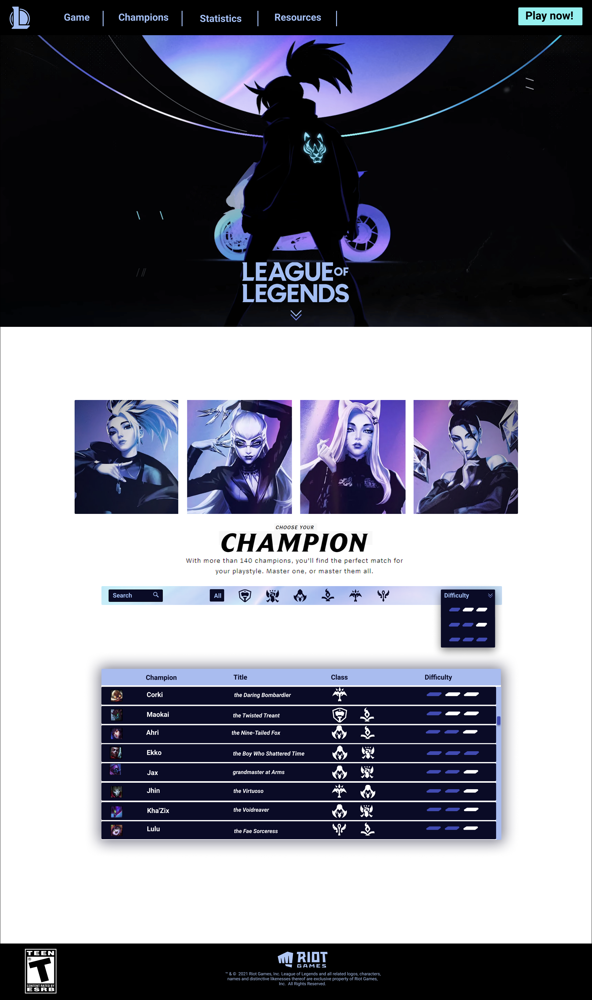

# Data Lovers: League of legends ⚔️

## Resumen del proyecto 📌

En este proyecto construimos una interfaz web que permite visualizar todos los campeones del juego y filtrarlos según su clase o dificultad de uso. Existen 6 clases y 3 niveles de dificultad. 

La página está pensada en nuestros usuarios (jugadores de LoL), por lo que las estadísticas disponibles para cada campeón son solo las que nos pidieron y se despliegan al clickear un campeón.

 

## Objetivos de aprendizaje 📚

Este proyecto me permitió reforzar mis conocimientos sobre manipulación de arreglos y objetos. También aprendí a trabajar con módulos de ECMAScript, a imprimir templates de manera dinámica y a crear y ejecutar test unitarios.

 

## Diseño de la interfaz 🔷

Disfruté mucho del proceso de diseño porque me gusta el juego, decidimos basar la estética de la página en KDA, que es una banda integrada por campeonas (personajes) del juego. En general todo jugador de lol es fan de KDA, así que recibimos feedback positivo por parte de nuestros usuarios.  

 

### - Prototipo de alta fidelidad  

*Hecho en Figma: lo usamos para hacer test de usabilidad en maze.co*

 

## Desarrollado con: 	🛠️ 
HTML, CSS y Vainilla Javascript. No estaba permitido usar librerías en este proyecto.

 

## Futuras actualizaciones 🎯
Optimizar el código con conocimientos actuales para que sea más eficiente.

 

##  Support 🤝
Bienvenidas sean las contribuciones, sugerencias y comentarios que tengas para este proyecto.

Deja una ⭐️si te gustó 💜
